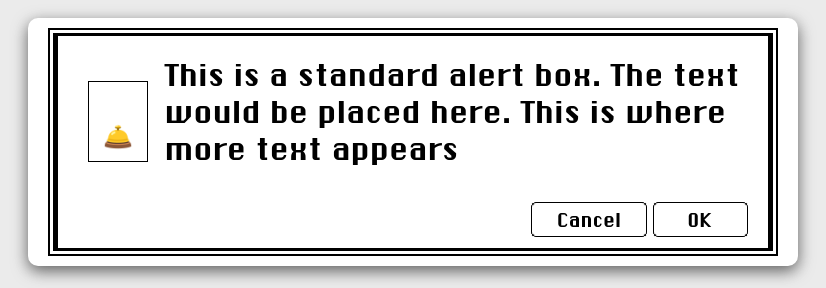

## A small but functional retro Apple-inspired modal



### Install

Install using `npm i modal-celestin`

### Usage

In a React app, use the Modal components:
`import { Modal } from 'modal'`

### Modal props

| Name         | Description                                                                |
| ------------ | -------------------------------------------------------------------------- |
| onClick      | function to include in a button to open or close the modal                 |
| openModal    | a boolean value to initialize the modal to a closed and not apparent state |
| setOpenModal | to toggle the state and open/close the modal                               |
| customText   | a string containing a text                                                 |
| customIcone  | a string containing an emoji or HTML CODE SYMBOL                           |

### Make it as a component !

- in your component folder, create a file for your modal that you will import later as it should be.

- then, at the top of your component page

`import React, { useState } from "react";`

`import { Modal } from "modal";`

- then, set the props :

```

const [openModal, setOpenModal] = useState(false);

const handleModal = (e) => {
    e.preventDefault();
    e.stopPropagation();
    setOpenModal((toggle) => !toggle);
  };

const customText =
    "Employee created";

const customIcone = <p>🛎️</p>;
```

- then insert in your function the **Modal** and export

```
<Modal
    openModal={openModal}
    setOpenModal={setOpenModal}
    customText={customText}
    customIcone={customIcone}
        />
```

- don't forget to insert `onClick={handleModal}` in a button for exemple

<Button>Submit</Button>
